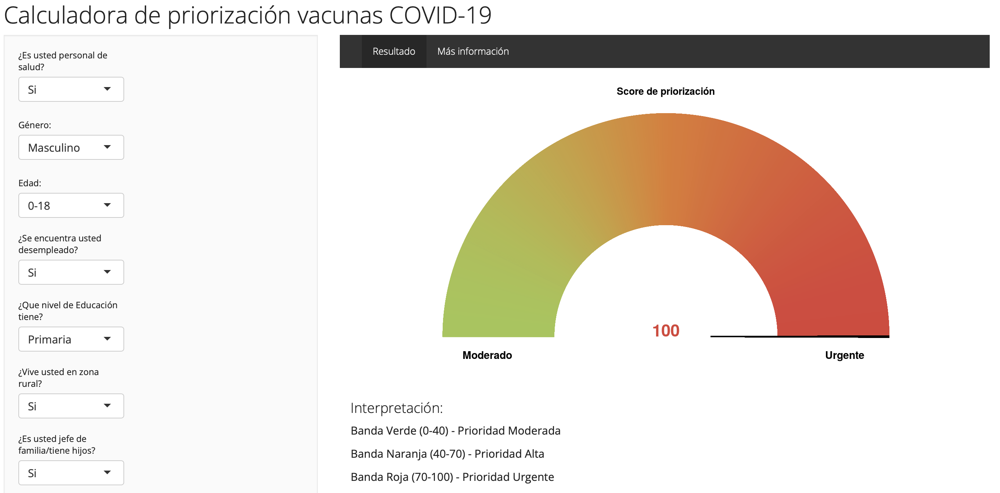

This Shiny web application was developed during the initial vaccine roll‐out in Ecuador to help individuals better understand their "priority status"" to receive their COVID‐19 vaccine. An algorithm was applied to calculate a priority score based on an individuals answers to a set of questions on socioeconomic status, occupation, exposure, risk behavior, comorbidities, etc. This was a collaboration with Raúl Fernández and Esteban Ortíz at Universidad de las Américas in Quito, Ecuador.

