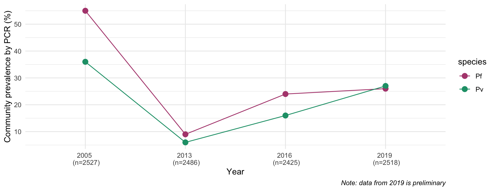

This work is part of a large, interdisciplinary and multi-institutional project funded by the [Asia-Pacific International Centers of Excellence for Malaria Research](https://www.niaid.nih.gov/research/asia-pacific-international-center-excellence-malaria-research) and aims to elucidate epidemiological, host and parasite risk factors that contribute to resurgent malaria in PNG communities.

Unpublished observations (Ruybal-Pesántez and Lautu-Gumal, *in prep*) have shown that PNG communities have experienced a resurgence in both *P. falciparum* and *P. vivax* transmission, however this increase in community prevalence is spatially heterogeneous. In-depth analysis of data from surveys conducted in 2016 and 2019 is underway to better understand the factors underlying malaria resurgence and characterize the rebound of *P. falciparum* and *P. vivax* with respect to individual-level risk factors (i.e., age), spatial heterogeneity, complexity of infection, and parasite genetic diversity.

