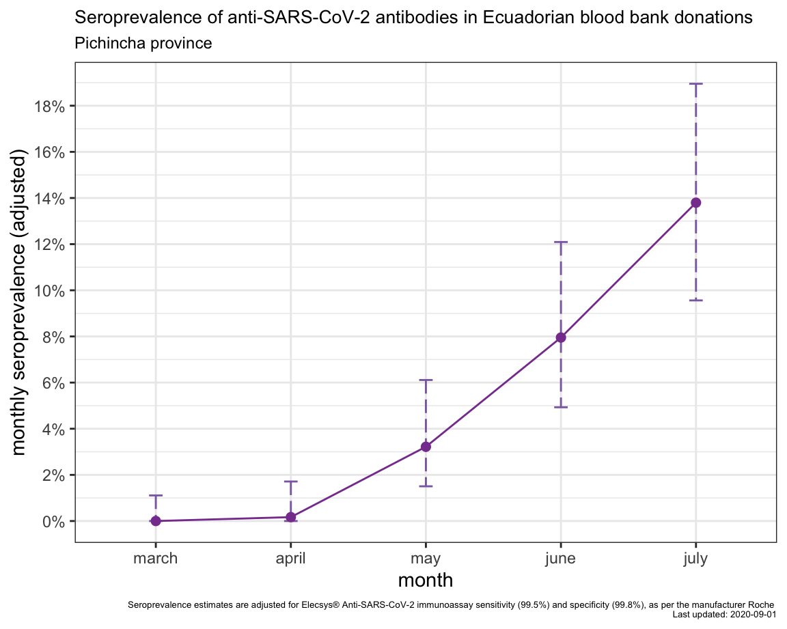

### Seroprevalence of anti-SARS-CoV-2 antibodies in Ecuadorian blood bank donors

Authors: Shazia Ruybal-Pesántez1,2,3,4, Gabriela Pineda5, Carla Hermosa5, Catalina Herrera5, Carlos Landázuri5, Marco Herdoiza5, Marco Fornasini6, Manuel Baldeon6

1 Population Health and Immunity Division, Walter and Eliza Hall Institute of Medical Research, Australia 

2 Department of Medical Biology and Bio21 Institute of Molecular Science and Biotechnology, University of Melbourne, Australia 

3 Vector-Borne Diseases and Tropical Public Health Group, Burnet Institute, Australia 

4 Colegio de Ciencias Biológicas y Ambientales, Universidad San Francisco de Quito USFQ, Ecuador 

5 Cruz Roja Ecuatoriana, Quito, Ecuador 

6 Universidad UTE, Quito, Ecuador

### Aim

Surveys to determine seroprevalence of anti-SARS-CoV-2 antibodies or seroconversion to SARS-CoV-2 ("serosurveys") can provide valuable indicators of population-level exposure, prevalence, incidence and extent of spread of SARS-CoV-2 infection to support epidemiological surveillance of COVID-19. In low- and middle-income countries, longitudinal testing of "convenience" samples, such as blood banks, coupled with highly specific and sensitive serological assays can provide important insights into population-level seroprevalence trends over time.

At the beginning of the COVID-19 epidemic in Ecuador, we anonymously screened blood donation samples from the Ecuadorian Red Cross National Blood Bank (Cruz Roja Ecuatoriana Hemocentro Nacional) as part of the emergency response to COVID-19 in Ecuador.

### Methods

We measured anti-SARS-CoV-2 antibodies using a commercially-available chemiluminescence immunoassay [Elecsys® Anti-SARS-CoV-2 assay from Roche](https://diagnostics.roche.com/global/en/products/params/elecsys-anti-sars-cov-2.html). According to the manufacturer, the sensitivity is 99.5% based on validation using 496 samples from 102 symptomatic patients with ≥14 days post-PCR confirmed SARS-CoV-2 infection. We assumed all of the blood donor samples would be at least ≥14 days post-infection. The specificity is 99.8%, based on validation using 10,453 samples from diagnostic routine and blood donors obtained before December 2019. We also independently screened 100 samples from blood donations collected in November 2019 as negative controls and they were all seronegative (100% specificity).

### Digital tools

An `R flexdashboard` was created to present anonymized and aggregated data generated from monthly screening of blood donation samples to visualize seroprevalence trends. Due to confidentiality and internal permissions at ERC this tool is not publicly available

