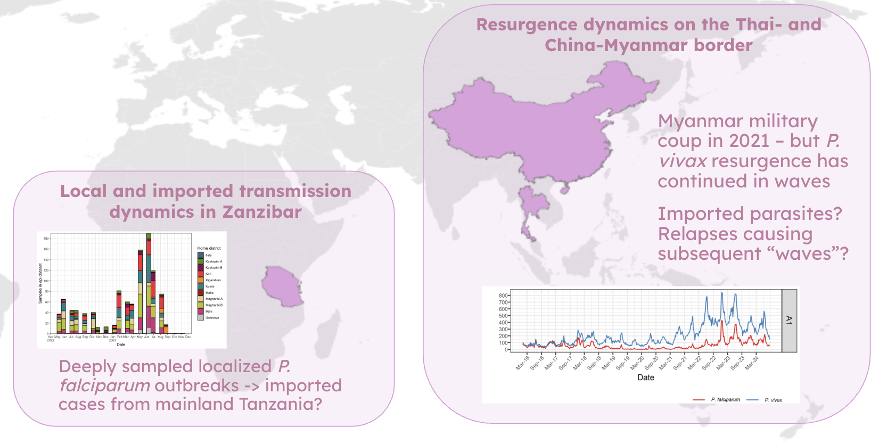

### Overview
This work pioneers innovative and operationally-relevant methods to reconstruct malaria transmission chains, 
and involves close collaboration with national malaria program (NMP) partners to apply these methods to address their decision-making needs. 
This work will generate new evidence on the drivers of malaria outbreaks, equipping NMPs with critical 
information to guide surveillance and response strategies. The main goal is to bridge the gap between 
genomic epidemiology research and its integration as a key feature of the malaria surveillance toolkit.

This research aims to develop a novel joint inference framework (objective 1), 
apply this framework to real-world situations by leveraging international collaborations with academic partners and NMPs 
in Africa and Asia-Pacific (objective 2), and translate these findings into actionable surveillance 
policy strategies for NMEPs and open-source software for the wider research community (objective 3). 

#### Outbreak analytics, computational models and transmission chain inference
In malaria we lack advanced methods to reconstruction transmission chains by extract meaningful genetic signals from 
pathogen genomic data, combined with epidemiological data. The unique biological features of malaria parasites, including the non-linear accumulation of genetic diversity due to sexual 
recombination in the mosquito vector, and the potential reactivation of dormant hypnozoites in the 
liver, causing relapses in the case of *P. vivax*, require novel approaches to ‘unlock’ the parasite’s 
genetic signals. Methods development in this research involves: 

- **{malariafwd}**: a simulation-based framework for *Plasmodium* genetic epidemiology, in particular this focuses on development 
of a population genetic simulator for *P. vivax* to ground truth expected genetic signals of *P. vivax* relapses
- **{plasmodiff}**: a diffusion network-based framework for reconstructing malaria transmission networks and estimating effective 
reproduction numbers from genomic and epidemiological data 

### Significance 
Applying these novel frameworks will inform on transmission chains (e.g., chain length), infer the relative contributions of imported and 
local cases, and describe strain-specific dynamics (e.g. evidence of rapidly emerging strains and strain/case reproduction numbers, Rc) to 
clarify patterns of recent malaria outbreaks and resurgence in areas attempting elimination. 

Alongside methods development, I have two main lines of research
focused on addressing this for both *P. falciparum* and *P. vivax*:

##### Importation dynamics in Zanzibar
The Zanzibar archipelago (off the coast of Tanzania) is aiming for malaria ‘pre-elimination’ status but has 
recently experienced several localized *P. falciparum* outbreaks from 2022-2024. Given its proximity to mainland Tanzania, it is imperative to 
understand whether cases are imported or locally-acquired for Zanzibar NMEP (ZAMEP) decision-making.

Working with collaborators in US (UNC Chapel Hill) and ZAMEP, we are analyzing high-resolution *P. falciparum* genetic data alongisde 
epidemiological and travel-history data using the novel transmission chain inference and simulation-based methods we are developing to
better understand the importation and the drivers of the recent outbreaks on Zanzibar. Genetic data includes both DBLα *var*
and molecular inversion probe microhaplotype sequencing, representing neutral genomic loci and rapidly evolving genes and allowing us to 
explore these distinct but complementary genetic signals. 

Main research questions:
- What role do imported infections play in sustaining malaria transmission?
- How connected are imported and local transmission chains? How long are these transmission chains?
- How does antigenic diversity and DBLα *var* diversity reflect fine-scale ancestry and transmission dynamics in outbreak and elimination settings?

##### Resurgence of *P. vivax* on the Thai-Myanmar and China-Myanmar border regions
Although malaria burden has declined substantially across the Thai-Myanmar border region, 
*P. vivax* continues to persist and periodically resurge. Of note, the Myanmar political crisis since 2021 has led to 
increased malaria cases. However, the drivers of these resurgence events remain poorly understood. 
In the context of China, despite its malaria elimination success, the China-Myanmar border area 
remains at potential risk of *P. vivax* resurgence because of sustained cross-border mobility with Myanmar. 

In these settings, it is critical to distinguish imported from locally acquired infections because *P. vivax* relapses (reactivated dormant liver stages) 
can sustain transmission after introduction and obscure epidemiological links. 

Working with collaborators in Australia (Menzies School of Health Research), Thailand (Shoklo Malaria Research Unit) and China (China CDC), 
we are analyzing high-resolution *P. vivax* genetic data alongisde routinely collected epidemiological and travel-history data using the novel 
transmission chain inference and simulation-based methods we are developing to better understand the resurgence and importation
dynamics across the Thai- and China-Myanmar border, respectively. 

Main research questions:
- How can genomic and epidemiological data be integrated to better understand *P. vivax* persistence and resurgence dynamics?
- How long are transmission chains from imported and locally-acquired cases?
- What is the relative contribution of relapses to overall infection burden and onwards transmission? 
